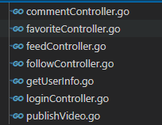
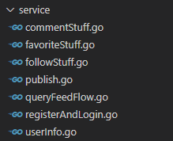
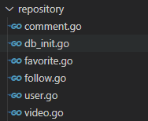

# 极简抖音项目

## 项目简介
本项目为极简版抖音的后端项目，已实现基础接口、扩展接口Ⅰ和扩展接口Ⅱ  
web框架：gin  
数据库：MySQL  
中间件：Redis
#### 演示视频：
[演示视频地址](http://rcmz8xyya.hd-bkt.clouddn.com/tiktokdemo.mp4)

## 小组简介
队名： 这次一定能做完队  
组长： 曹宇帆  
成员： 胡义秋、章嘉锋、周玥、平航、黄文涌

本小组按照不同接口进行分工

视频流:胡义秋   
登录注册:章嘉锋   
投稿发布:周玥  
点赞和列表 :平航   
评论:曹宇帆  
关注粉丝:黄文涌  
整理与文档：胡义秋

## 项目架构
本项目使用经典的**MVC三层架构**  
其中：  
controller层负责响应接口      
   
service层负责处理业务逻辑  
      
repository层负责数据库交互    
 
